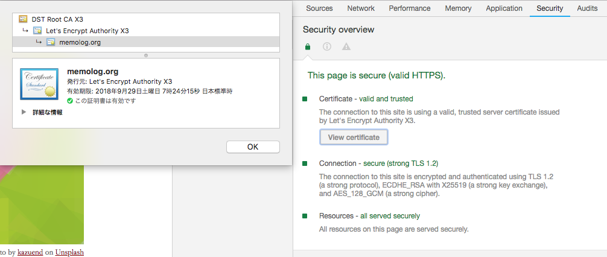

このサイトは[Hexo](https://hexo.io/)を使ってGithub Pagesに公開しているのだけど、最近[Github PagesカスタムドメインでもHTTPSをサポートしてくれるようになった](https://blog.github.com/2018-05-01-github-pages-custom-domains-https/)ので、[適当にリダイレクトかけていた](../../2018/redirect-to-my-old-blog/)元の memolog.org のドメインを設定することにした。<!-- more -->

まず[Setting up an apex domain](https://help.github.com/articles/setting-up-an-apex-domain/)にしたがって、memolog.org の Aレコードを変更。

その後、Github の設定画面の「Custom domain」に memolog.org を入れて、準備ができたら Enforce HTTPS を有効にして完了。

このままだとHexoでGithub Pagesに記事を更新するときにHTTPS設定が外れてしまうので、[hexo-deployer-gitのissue](https://github.com/hexojs/hexo-deployer-git/issues/87)を参考に、sourceのディレクトリに[CNAMEファイル](https://github.com/memolog/blog/blob/master/source/CNAME)を追加。

Chromeでdev toolsで証明書の確認したらちゃんとLet's encryptから発行されていました。

