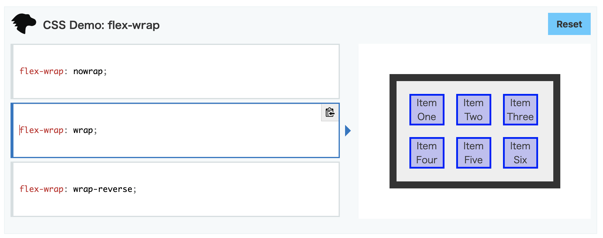
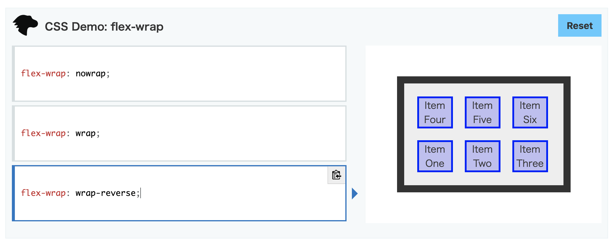

前回の[Flex Flow Direction: the flex-direction property](https://memolog.org/2020/flex-flow-direction.html)から引き続き。[5.2. Flex Line Wrapping: the flex-wrap property](https://www.w3.org/TR/css-flexbox-1/#flex-wrap-property)について<!-- more -->

|key|value|
--|--
|Name|flex-wrap|
|Value|nowrap &#124; wrap &#124; wrap-reverse|
|Initial|nowrap|
|Applies to|flex containers|
|Inherited|no|
|Percentages|n/a|
|Computed value|specified keyword|
|Canonical order|per grammar|
|Animation type|discrete|

> The flex-wrap property controls whether the flex container is single-line or multi-line, and the direction of the cross-axis, which determines the direction new lines are stacked in.

`flex-wrap`プロパティはflex containerが1行か複数行かを制御し、またcross-axisの方向を制御して新しい行が積み重なる方向を決定する。

> **nowrap**
> The flex container is single-line.

**nowrap**
flex containerは1行になる。

> **wrap**
> The flex container is multi-line.

**wrap**
flex containerは複数行になる。

> **wrap-reverse**
> Same as wrap.

**wrap-reverse**
wrapと同様

> For the values that are not wrap-reverse, the cross-start direction is equivalent to either the inline-start or block-start direction of the current writing mode (whichever is in the cross axis) and the cross-end direction is the opposite direction of cross-start. When flex-wrap is wrap-reverse, the cross-start and cross-end directions are swapped.

`wrap-reverse`以外の値の場合、cross-startの方向は、現在のwriting mode（cross axisがある方）のinline-startかblock-startのどちらかと同じになる。また、cross-endの方向はcross-startの方向と反対になる。flex-wrapが`wrap-reverse`の場合は、cross-startとcross-endの方向が入れ替わる。

以下のflex wrapのサンプルは[flex-wrap - CSS: カスケーディングスタイルシート | MDN](https://developer.mozilla.org/ja/docs/Web/CSS/flex-wrap)のサンプルの画面キャプチャ。writing modeは`horizontal-tb`で上から下、左から右という流れ。

`nowrap`の場合は、main axisに沿って左から右に一列で並ぶ。折り返さない。

`wrap`の場合は、main-endに到達したところで折り返し、複数行になる。折り返した後の要素は下側に並ぶ。

`wrap-reverse`の場合は、main-endに到達したところで折り返すのはwrapと同様。左から右に並ぶ流れは変わらないが、cross-startとcross-endの方向が入れ替わり、折り返した後の要素が上側に並ぶ。

